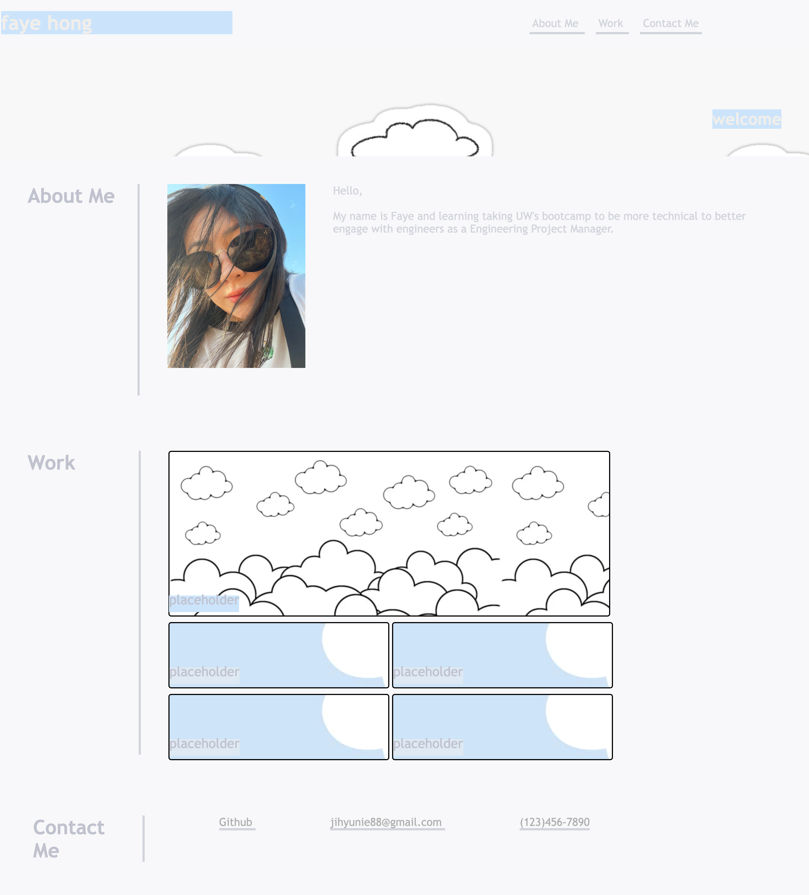

## Table of contents
​
- [Overview](#overview)
  - [Description](#description)
  - [Screenshot](#screenshot)
  - [Links](#links)
- [My process](#my-process)
  - [Built with](#built-with)
  - [What I learned](#what-i-learned)

​
​## Overview
​
### Description
​
This week's challenge was to build a portfolio page from scratch by using HTML and Advanced CSS. The goal of this assignment was to build a web application from the ground up that would showcase who I am, my work, and contact info. The page had resemble the mock up, links that directed the users to the section, links to my work, see hover states for all interactive elements, responsive layout that adapts to users' viewport, and working contact info.
​
​
### Screenshot
​

​
​
### Links
​
- GitHub URL: [https://github.com/hong-f/advanced-css-portfolio-fhong]
- Live Site URL: [https://hong-f.github.io/advanced-css-portfolio-fhong/]
​
## My process
I took the approach of starting with building out the skeleton and adding in the CSS. This helped section out what content would be housed where. I also did my best to be as attention to detail of how the mock up page behaved to try to replicate it as close as possible. 
​
### Built with
​
- Semantic HTML markup
- CSS 
- Flexbox
- CSS Grid
- Media query
​
​
### What I learned
​
In retrospect, I definitely could be more conscise with my CSS and consolidated as much as possible. The grid columns I used could've been much more simplified. As a best practice, I learned the hard way of using percentages of px which lead me to have to manually hard code my media query for my page to respond correctly. 
​

